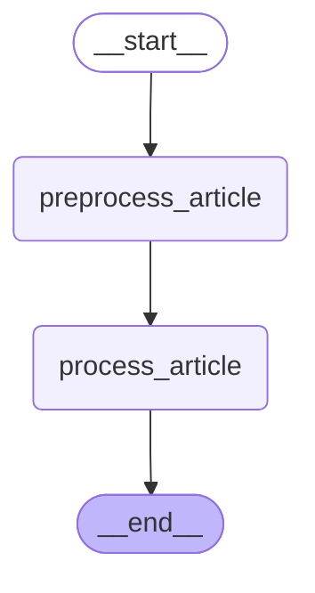

# Multi-Agent Comments Generator for RSS Reader

This repository contains a CLI tool (`rss_agent_cli.py`) that reads RSS/Atom feeds and asks multiple AI “agents” (configured prompts) to generate short comments from different perspectives. Results are printed to the console and each article is recorded in a local SQLite database to avoid duplicates.

## Features
1. Parse configured RSS feeds with `feedparser`.
2. Preprocess each entry (clean HTML, extract keywords, measure length).
3. Store articles in SQLite when they are loaded for the first time.
4. For each agent, call Google Gemini and print the generated comment using the article's summary.
5. Utilize `LangGraph` to define the article processing workflow, including preprocessing and comment generation steps.

## Usage
Prerequisites: Python 3.11+, a Google API key for Gemini (please modify codes when you use other models).

1. Install
```bash
git clone https://github.com/misgnros/rss-agent.git
cd rss_agent
```

2. Set your API key
```bash
export GOOGLE_API_KEY="your-api-key"
```

3. Configure
Edit `config.py` to fit your needs:
- `RSS_FEEDS`: list of feed URLs
- `AGENTS`: list of (name, instruction) tuples
- `GEMINI_MODEL`: Gemini model name
- `MAX_ARTICLES_PER_FEED`: per-run limit
- `API_CALL_DELAY`: delay between AI calls (seconds)
- `DB_FILE`: SQLite file path

Minimal example:
```python
RSS_FEEDS = ["https://example.com/feed.xml"]
AGENTS = [
    ("Optimistic Analyst", "Highlight potential benefits succinctly."),
    ("Critical Reviewer", "Point out potential risks and gaps concisely."),
    ("Neutral Summarizer", "Summarize the main points objectively in 2-3 sentences."),
]
```
*Example is written in Japanese.

4. Run
```bash
python3 rss_agent_cli.py
```

## Typical Output
```
============================================================
Feed: https://example.com/feed.xml
============================================================
5 articles found. Processing latest 5 articles.
...
[Optimistic Analyst]
Concise positive take...

[Critical Reviewer]
Concise critical take...

[Neutral Summarizer]
Objective summary...
------------------------------------------------------------
```

## Graph


